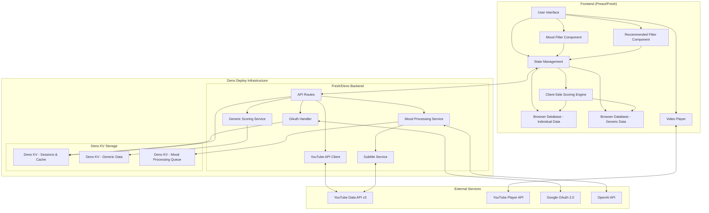

# Design Document

## Overview

The YouTube API Integration system implements a hybrid architecture combining a Deno Deploy backend service for YouTube API communication with a Preact/Fresh frontend that maintains local-first data storage principles. The system fetches user subscriptions, aggregates new content, applies algorithmic scoring, and provides video playback capabilities while storing all data locally in browser databases for offline access.

## Architecture

### High-Level Architecture



### Data Flow

1. **Authentication Flow**: User authenticates via OAuth 2.0 through Fresh backend routes
2. **Subscription Sync**: Backend API routes fetch subscriptions and forward to frontend for local storage
3. **Content Aggregation**: Backend retrieves new videos from subscribed channels via Fresh API routes
4. **Mood Processing**: Backend processes new videos through OpenAI API for mood classification
   - Combines video title, description, channel description, and subtitles (if available)
   - Queues videos for batch processing to optimize API usage
   - Stores mood results with confidence scores
5. **Generic Data Sync**: Backend optionally provides generic scoring data stored in Deno KV
6. **Client-Side Scoring**: Frontend calculates individualized scores using local algorithms + optional generic data
7. **Mood & Recommendation Filtering**: Frontend applies mood filters and recommended sorting based on user selections
8. **Video Playback**: Direct integration with YouTube Player API from frontend
9. **Local Storage**: Individual data, generic data, and mood classifications stored separately in browser databases

## Components and Interfaces

### Frontend Components

#### 1. Authentication Manager
```typescript
interface AuthManager {
  initiateLogin(): Promise<void>
  handleCallback(code: string): Promise<AuthToken>
  refreshToken(): Promise<AuthToken>
  logout(): void
  isAuthenticated(): boolean
}
```

#### 2. Subscription Manager
```typescript
interface SubscriptionManager {
  syncSubscriptions(): Promise<Subscription[]>
  getSubscriptions(): Promise<Subscription[]>
  getSubscriptionById(id: string): Promise<Subscription | null>
}

interface Subscription {
  id: string
  channelId: string
  title: string
  description: string
  thumbnail: string
  subscriberCount: number
  lastSyncDate: Date
}
```

#### 3. Content Manager
```typescript
interface ContentManager {
  syncNewContent(): Promise<Video[]>
  getVideos(filters?: VideoFilters): Promise<Video[]>
  markAsWatched(videoId: string): Promise<void>
  bookmarkVideo(videoId: string): Promise<void>
  applyMoodFilter(videos: Video[], moods: MoodCategory[]): Video[]
  applyRecommendedSort(videos: Video[]): Video[]
}

interface Video {
  id: string
  title: string
  description: string
  thumbnail: string
  channelId: string
  channelTitle: string
  publishedAt: Date
  duration: string
  viewCount: number
  likeCount: number
  commentCount?: number
  score?: number
  channelScore?: number // 1-80 component
  subscriptionScore?: number // 0-20 component
  lastScoreUpdate?: Date
  scoringStatus: ScoringStatus
  mood?: MoodCategory
  moodConfidence?: number // 0-1 confidence score from OpenAI
  moodProcessedAt?: Date
  watched: boolean
  bookmarked: boolean
}

enum MoodCategory {
  LEARN = 'Learn',
  FUN = 'Fun',
  LOVE = 'Love',
  PLAY = 'Play',
  DISCOVER = 'Discover',
  REFLECT = 'Reflect'
}

interface VideoFilters {
  channelId?: string
  watched?: boolean
  dateRange?: { start: Date; end: Date }
  scoreRange?: { min: number; max: number }
  includeAwaitingScoring?: boolean // Default: false
  scoringStatus?: ScoringStatus
  moods?: MoodCategory[] // Filter by selected moods
  recommendedSort?: boolean // Sort by score high-to-low
}

enum ScoringStatus {
  AWAITING_SCORING = 'awaiting_scoring', // <24 hours old
  SCOREABLE = 'scoreable', // >1 hour, <24 hours old  
  SCORED = 'scored' // >24 hours old with calculated score
}
```

#### 4. Client-Side Scoring Engine
```typescript
interface ScoringEngine {
  calculateScore(video: Video, context: ScoringContext): Promise<number>
  updateScores(videos: Video[]): Promise<Video[]>
  canCalculateScore(video: Video): boolean // Must be >1 hour since publish
  getScoringStatus(video: Video): ScoringStatus
  filterByScoring(videos: Video[], includeAwaitingScoring: boolean): Video[]
  syncGenericData(): Promise<void> // Fetch latest generic scoring data
}

interface GenericDataManager {
  fetchChannelBenchmarks(channelIds: string[]): Promise<ChannelBenchmark[]>
  fetchTrendData(): Promise<TrendData[]>
  fetchCategoryAverages(): Promise<CategoryAverage[]>
  storeGenericData(data: GenericScoringData): Promise<void>
  getGenericData(): Promise<GenericScoringData | null>
}

interface GenericScoringData {
  channelBenchmarks: ChannelBenchmark[]
  trendData: TrendData[]
  categoryAverages: CategoryAverage[]
  lastSyncDate: Date
  dataSource: 'generic'
}

interface ScoringContext {
  individualData: {
    channelHistory: ChannelVideoHistory[]
    subscriptionVideos: Video[]
    userViewingHistory: ViewingHistory[]
  }
  genericData?: {
    channelBenchmarks: ChannelBenchmark[]
    globalTrends: TrendData[]
    categoryAverages: CategoryAverage[]
  }
  measurementPeriod: MeasurementPeriod
}

interface ChannelBenchmark {
  channelId: string
  averageViewsPerHour: number
  averageLikesPerHour: number
  videoCount: number
  dataSource: 'generic' // Always generic for benchmarks
  lastUpdated: Date
}

interface TrendData {
  category: string
  trendingTopics: string[]
  averageEngagement: number
  dataSource: 'generic'
  lastUpdated: Date
}

interface CategoryAverage {
  category: string
  averageScore: number
  videoCount: number
  dataSource: 'generic'
  lastUpdated: Date
}

interface ScoringConfig {
  measurementPeriod: MeasurementPeriod // 'week' | 'month' | 'year'
  minimumAgeHours: number // Default: 1 hour
  channelScoreRange: { min: number; max: number } // 1-80
  subscriptionScoreRange: { min: number; max: number } // 0-20
}

interface VelocityMetrics {
  viewsPerHour: number
  likesPerHour: number
  commentsPerHour: number
  hoursElapsed: number
}

interface ChannelVideoHistory {
  channelId: string
  videos: {
    id: string
    publishedAt: Date
    currentViews: number
    currentLikes: number
    velocityAtSameAge: VelocityMetrics
  }[]
}

type MeasurementPeriod = 'week' | 'month' | 'year'
```

#### 5. Video Player Component
```typescript
interface VideoPlayer {
  loadVideo(videoId: string): void
  play(): void
  pause(): void
  seekTo(seconds: number): void
  getCurrentTime(): number
  onStateChange(callback: (state: PlayerState) => void): void
}

enum PlayerState {
  UNSTARTED = -1,
  ENDED = 0,
  PLAYING = 1,
  PAUSED = 2,
  BUFFERING = 3,
  CUED = 5
}
```

### Backend Components (Cloudflare Workers)

#### 1. YouTube API Client
```typescript
interface YouTubeAPIClient {
  getSubscriptions(accessToken: string): Promise<SubscriptionResponse>
  getChannelVideos(channelId: string, maxResults: number): Promise<VideoResponse>
  getVideoDetails(videoIds: string[]): Promise<VideoDetailsResponse>
}
```

#### 2. OAuth Handler (using Deno OAuth)
```typescript
interface OAuthHandler {
  generateAuthUrl(): string
  exchangeCodeForTokens(code: string): Promise<TokenResponse>
  refreshAccessToken(refreshToken: string): Promise<TokenResponse>
  storeTokens(userId: string, tokens: TokenResponse): Promise<void>
  getStoredTokens(userId: string): Promise<TokenResponse | null>
}

// Implementation using Deno OAuth library
class DenoOAuthHandler implements OAuthHandler {
  constructor(
    private kv: Deno.Kv,
    private clientId: string,
    private clientSecret: string
  ) {}
  
  generateAuthUrl(): string {
    // Using Deno's built-in OAuth support
    return createGoogleOAuthUrl({
      clientId: this.clientId,
      redirectUri: 'https://your-app.deno.dev/auth/callback',
      scope: 'https://www.googleapis.com/auth/youtube.readonly'
    })
  }
}
```

#### 3. Deno KV Storage Managers
```typescript
interface DenoKVManager {
  // User session and generic data storage using Deno KV
  storeUserSession(session: UserSession): Promise<void>
  getUserSession(sessionId: string): Promise<UserSession | null>
  storeGenericScoringData(data: GenericScoringData): Promise<void>
  getGenericScoringData(): Promise<GenericScoringData | null>
}

interface KVCacheManager {
  // Fast API response caching using Deno KV
  get<T>(key: string): Promise<T | null>
  set<T>(key: string, value: T, expireIn?: number): Promise<void>
  delete(key: string): Promise<void>
}

// Implementation using Deno KV
class DenoKVStorageManager implements DenoKVManager, KVCacheManager {
  constructor(private kv: Deno.Kv) {}
  
  async storeUserSession(session: UserSession): Promise<void> {
    await this.kv.set(["sessions", session.id], session)
  }
  
  async get<T>(key: string): Promise<T | null> {
    const result = await this.kv.get([key])
    return result.value as T | null
  }
  
  async set<T>(key: string, value: T, expireIn?: number): Promise<void> {
    const options = expireIn ? { expireIn } : undefined
    await this.kv.set([key], value, options)
  }
}
```

#### 4. Generic Scoring Data Service
```typescript
interface GenericScoringService {
  aggregateChannelBenchmarks(): Promise<ChannelBenchmark[]>
  calculateTrendData(): Promise<TrendData[]>
  computeCategoryAverages(): Promise<CategoryAverage[]>
  scheduleDataRefresh(): Promise<void>
}
```

#### 5. Mood Processing Service
```typescript
interface MoodProcessingService {
  processVideoMood(video: VideoMoodInput): Promise<MoodResult>
  batchProcessMoods(videos: VideoMoodInput[]): Promise<MoodResult[]>
  getSubtitles(videoId: string): Promise<string | null>
}

interface VideoMoodInput {
  videoId: string
  title: string
  description: string
  channelId: string
  channelDescription?: string
}

interface MoodResult {
  videoId: string
  mood: MoodCategory
  confidence: number // 0-1 confidence score
  reasoning?: string // Optional explanation from OpenAI
  processedAt: Date
}

interface OpenAIMoodClassifier {
  classifyMood(input: MoodClassificationInput): Promise<MoodResult>
}

interface MoodClassificationInput {
  videoTitle: string
  videoDescription: string
  channelDescription?: string
  subtitlesText?: string
}

// OpenAI Integration
class OpenAIMoodProcessor implements OpenAIMoodClassifier {
  constructor(private apiKey: string) {}
  
  async classifyMood(input: MoodClassificationInput): Promise<MoodResult> {
    const prompt = this.buildMoodClassificationPrompt(input)
    
    const response = await fetch('https://api.openai.com/v1/chat/completions', {
      method: 'POST',
      headers: {
        'Authorization': `Bearer ${this.apiKey}`,
        'Content-Type': 'application/json'
      },
      body: JSON.stringify({
        model: 'gpt-3.5-turbo',
        messages: [
          {
            role: 'system',
            content: this.getSystemPrompt()
          },
          {
            role: 'user',
            content: prompt
          }
        ],
        temperature: 0.3,
        max_tokens: 150
      })
    })
    
    const result = await response.json()
    return this.parseMoodResponse(result.choices[0].message.content)
  }
  
  private getSystemPrompt(): string {
    return `You are a content mood classifier. Analyze YouTube video content and classify it into exactly one of these six mood categories:

- Learn: Educational, tutorial, informational, skill-building content
- Fun: Entertainment, comedy, lighthearted, amusing content  
- Love: Heartwarming, emotional, relationship, family, inspirational content
- Play: Gaming, sports, interactive, competitive, playful content
- Discover: Exploration, travel, new experiences, curiosity-driven content
- Reflect: Thoughtful, philosophical, introspective, contemplative content

Respond with JSON format: {"mood": "category", "confidence": 0.85, "reasoning": "brief explanation"}

Base your classification on the video title, description, channel context, and subtitles (if provided). Consider the primary intent and emotional tone of the content.`
  }
  
  private buildMoodClassificationPrompt(input: MoodClassificationInput): string {
    let prompt = `Classify this YouTube video content:

Title: "${input.videoTitle}"
Description: "${input.videoDescription}"`

    if (input.channelDescription) {
      prompt += `\nChannel Context: "${input.channelDescription}"`
    }
    
    if (input.subtitlesText) {
      // Truncate subtitles to avoid token limits
      const truncatedSubtitles = input.subtitlesText.substring(0, 1000)
      prompt += `\nSubtitles Sample: "${truncatedSubtitles}"`
    }
    
    return prompt
  }
  
  private parseMoodResponse(response: string): MoodResult {
    try {
      const parsed = JSON.parse(response)
      return {
        videoId: '', // Will be set by caller
        mood: parsed.mood as MoodCategory,
        confidence: parsed.confidence || 0.5,
        reasoning: parsed.reasoning,
        processedAt: new Date()
      }
    } catch (error) {
      // Fallback parsing if JSON fails
      return {
        videoId: '',
        mood: MoodCategory.DISCOVER, // Default fallback
        confidence: 0.1,
        reasoning: 'Failed to parse OpenAI response',
        processedAt: new Date()
      }
    }
  }
}
```

## Data Models

### Browser Database Schema

#### Individual User Data (Primary Database)

#### Subscriptions Table
```sql
CREATE TABLE subscriptions (
  id TEXT PRIMARY KEY,
  channel_id TEXT UNIQUE NOT NULL,
  title TEXT NOT NULL,
  description TEXT,
  thumbnail TEXT,
  subscriber_count INTEGER,
  last_sync_date DATETIME,
  created_at DATETIME DEFAULT CURRENT_TIMESTAMP
);
```

#### Videos Table
```sql
CREATE TABLE videos (
  id TEXT PRIMARY KEY,
  title TEXT NOT NULL,
  description TEXT,
  thumbnail TEXT,
  channel_id TEXT NOT NULL,
  channel_title TEXT NOT NULL,
  published_at DATETIME NOT NULL,
  duration TEXT,
  view_count INTEGER,
  like_count INTEGER,
  comment_count INTEGER,
  score REAL,
  channel_score REAL, -- 1-80 component
  subscription_score REAL, -- 0-20 component
  scoring_status TEXT CHECK (scoring_status IN ('awaiting_scoring', 'scoreable', 'scored')) DEFAULT 'awaiting_scoring',
  last_score_update DATETIME,
  mood TEXT CHECK (mood IN ('Learn', 'Fun', 'Love', 'Play', 'Discover', 'Reflect')),
  mood_confidence REAL CHECK (mood_confidence >= 0 AND mood_confidence <= 1),
  mood_processed_at DATETIME,
  watched BOOLEAN DEFAULT FALSE,
  bookmarked BOOLEAN DEFAULT FALSE,
  watch_progress INTEGER DEFAULT 0,
  created_at DATETIME DEFAULT CURRENT_TIMESTAMP,
  FOREIGN KEY (channel_id) REFERENCES subscriptions(channel_id)
);

CREATE INDEX idx_videos_published_at ON videos(published_at);
CREATE INDEX idx_videos_channel_published ON videos(channel_id, published_at);
CREATE INDEX idx_videos_score ON videos(score DESC);
CREATE INDEX idx_videos_scoring_status ON videos(scoring_status, published_at);
CREATE INDEX idx_videos_mood ON videos(mood);
CREATE INDEX idx_videos_mood_score ON videos(mood, score DESC);
```

#### Channel Velocity History Table
```sql
CREATE TABLE channel_velocity_history (
  id INTEGER PRIMARY KEY AUTOINCREMENT,
  channel_id TEXT NOT NULL,
  video_id TEXT NOT NULL,
  hours_elapsed INTEGER NOT NULL,
  views_per_hour REAL NOT NULL,
  likes_per_hour REAL NOT NULL,
  comments_per_hour REAL DEFAULT 0,
  recorded_at DATETIME DEFAULT CURRENT_TIMESTAMP,
  FOREIGN KEY (channel_id) REFERENCES subscriptions(channel_id),
  FOREIGN KEY (video_id) REFERENCES videos(id)
);

CREATE INDEX idx_velocity_channel_hours ON channel_velocity_history(channel_id, hours_elapsed);
```

#### Scoring Configuration Table
```sql
CREATE TABLE scoring_config (
  measurement_period TEXT PRIMARY KEY CHECK (measurement_period IN ('week', 'month', 'year')),
  is_active BOOLEAN DEFAULT FALSE,
  updated_at DATETIME DEFAULT CURRENT_TIMESTAMP
);

INSERT INTO scoring_config (measurement_period, is_active) VALUES ('month', TRUE);
```

#### Generic Scoring Data (Separate Database)

#### Channel Benchmarks Table
```sql
CREATE TABLE generic_channel_benchmarks (
  channel_id TEXT PRIMARY KEY,
  average_views_per_hour REAL NOT NULL,
  average_likes_per_hour REAL NOT NULL,
  video_count INTEGER NOT NULL,
  data_source TEXT DEFAULT 'generic' CHECK (data_source = 'generic'),
  last_updated DATETIME DEFAULT CURRENT_TIMESTAMP
);
```

#### Trend Data Table
```sql
CREATE TABLE generic_trend_data (
  id INTEGER PRIMARY KEY AUTOINCREMENT,
  category TEXT NOT NULL,
  trending_topics TEXT NOT NULL, -- JSON array
  average_engagement REAL NOT NULL,
  data_source TEXT DEFAULT 'generic' CHECK (data_source = 'generic'),
  last_updated DATETIME DEFAULT CURRENT_TIMESTAMP
);
```

#### Category Averages Table
```sql
CREATE TABLE generic_category_averages (
  category TEXT PRIMARY KEY,
  average_score REAL NOT NULL,
  video_count INTEGER NOT NULL,
  data_source TEXT DEFAULT 'generic' CHECK (data_source = 'generic'),
  last_updated DATETIME DEFAULT CURRENT_TIMESTAMP
);
```

#### Generic Data Sync Log
```sql
CREATE TABLE generic_data_sync_log (
  id INTEGER PRIMARY KEY AUTOINCREMENT,
  sync_type TEXT NOT NULL, -- 'benchmarks', 'trends', 'categories'
  records_updated INTEGER DEFAULT 0,
  sync_status TEXT CHECK (sync_status IN ('success', 'failed', 'partial')),
  error_message TEXT,
  synced_at DATETIME DEFAULT CURRENT_TIMESTAMP
);
```

#### Mood Processing Log
```sql
CREATE TABLE mood_processing_log (
  id INTEGER PRIMARY KEY AUTOINCREMENT,
  video_id TEXT NOT NULL,
  processing_status TEXT CHECK (processing_status IN ('pending', 'processing', 'completed', 'failed')) DEFAULT 'pending',
  mood_result TEXT, -- JSON with mood, confidence, reasoning
  error_message TEXT,
  openai_tokens_used INTEGER,
  processing_duration_ms INTEGER,
  processed_at DATETIME DEFAULT CURRENT_TIMESTAMP,
  FOREIGN KEY (video_id) REFERENCES videos(id)
);

CREATE INDEX idx_mood_log_status ON mood_processing_log(processing_status, processed_at);
CREATE INDEX idx_mood_log_video ON mood_processing_log(video_id);
```

### Backend Data Schema (Deno KV)

#### User Sessions (Deno KV)
```typescript
// Key: ["sessions", sessionId]
interface UserSession {
  id: string
  userId: string
  accessToken: string
  refreshToken: string
  tokenExpiresAt: Date
  createdAt: Date
  lastAccessed: Date
}
```

#### Generic Channel Benchmarks (Deno KV)
```typescript
// Key: ["benchmarks", "channels", channelId]
interface ChannelBenchmark {
  channelId: string
  averageViewsPerHour: number
  averageLikesPerHour: number
  videoCount: number
  sampleSize: number
  confidenceScore: number
  lastCalculated: Date
}
```

#### Generic Trend Analytics (Deno KV)
```typescript
// Key: ["analytics", "trends", category]
interface TrendAnalytics {
  category: string
  trendingKeywords: string[]
  averageEngagement: number
  sampleSize: number
  calculationPeriod: 'week' | 'month' | 'year'
  calculatedAt: Date
}
```

#### API Usage Tracking (Deno KV)
```typescript
// Key: ["usage", userId, timestamp]
interface APIUsageLog {
  userId?: string
  endpoint: string
  quotaUsed: number
  responseStatus: number
  responseTimeMs: number
  requestedAt: Date
}
```

#### User Preferences Table
```sql
CREATE TABLE user_preferences (
  key TEXT PRIMARY KEY,
  value TEXT NOT NULL,
  updated_at DATETIME DEFAULT CURRENT_TIMESTAMP
);
```

#### Viewing History Table
```sql
CREATE TABLE viewing_history (
  id INTEGER PRIMARY KEY AUTOINCREMENT,
  video_id TEXT NOT NULL,
  watched_at DATETIME DEFAULT CURRENT_TIMESTAMP,
  watch_duration INTEGER,
  completion_percentage REAL,
  FOREIGN KEY (video_id) REFERENCES videos(id)
);
```

### API Response Models

#### YouTube API Responses
```typescript
interface SubscriptionResponse {
  items: {
    id: string
    snippet: {
      channelId: string
      title: string
      description: string
      thumbnails: {
        default: { url: string }
        medium: { url: string }
        high: { url: string }
      }
    }
  }[]
  nextPageToken?: string
}

interface VideoResponse {
  items: {
    id: { videoId: string }
    snippet: {
      title: string
      description: string
      channelId: string
      channelTitle: string
      publishedAt: string
      thumbnails: {
        medium: { url: string }
        high: { url: string }
      }
    }
  }[]
}
```

## Error Handling

### Error Categories

1. **Authentication Errors**
   - Invalid or expired tokens
   - OAuth flow interruptions
   - Permission scope issues

2. **API Rate Limiting**
   - YouTube API quota exceeded
   - Request throttling
   - Temporary service unavailability

3. **Network Errors**
   - Connection timeouts
   - DNS resolution failures
   - CORS issues (backend only)

4. **Data Storage Errors**
   - Browser database quota exceeded
   - IndexedDB transaction failures
   - Data corruption or migration issues

### Error Handling Strategy

```typescript
interface ErrorHandler {
  handleAuthError(error: AuthError): Promise<void>
  handleAPIError(error: APIError): Promise<void>
  handleStorageError(error: StorageError): Promise<void>
  handleNetworkError(error: NetworkError): Promise<void>
}

class ErrorRecovery {
  // Exponential backoff for API calls
  async retryWithBackoff<T>(
    operation: () => Promise<T>,
    maxRetries: number = 3
  ): Promise<T>
  
  // Graceful degradation to cached data
  async fallbackToCachedData<T>(
    primarySource: () => Promise<T>,
    cacheSource: () => Promise<T>
  ): Promise<T>
}
```

## Testing Strategy

### Unit Testing
- **Frontend Components**: Test React components with @testing-library/preact
- **Business Logic**: Test scoring algorithms, data transformations, and state management
- **API Clients**: Mock YouTube API responses and test error scenarios
- **Database Operations**: Test CRUD operations with in-memory SQLite

### Integration Testing
- **API Integration**: Test complete OAuth flow and YouTube API communication
- **Database Integration**: Test data synchronization between backend and frontend
- **Player Integration**: Test YouTube Player API embedding and event handling

### End-to-End Testing
- **User Workflows**: Test complete user journeys from login to video playback
- **Offline Scenarios**: Test application behavior when backend is unavailable
- **Performance Testing**: Test with large subscription lists and video catalogs

### Testing Tools
- **Frontend**: Vitest, @testing-library/preact, MSW for API mocking
- **Backend**: Deno's built-in test runner, Supertest for HTTP testing
- **E2E**: Playwright for cross-browser testing
- **Database**: In-memory SQLite for isolated testing

## Technology Stack

### Frontend
- **Framework**: Preact + Fresh (Deno-based SSR)
- **Database**: IndexedDB (via Dexie.js or similar)
- **State Management**: Preact Signals
- **Styling**: Tailwind CSS (built into Fresh)
- **Build Tool**: Fresh's built-in Deno tooling

### Backend (Deno Deploy)
- **Runtime**: Deno Deploy (V8 isolates with Deno APIs)
- **Framework**: Fresh (full-stack with API routes)
- **OAuth Library**: Deno's built-in OAuth support
- **Database**: Deno KV (built-in key-value store)
- **Caching**: Deno KV with TTL support
- **HTTP Client**: Deno's built-in fetch API

### Deployment
- **Full-Stack**: Deno Deploy (single deployment for frontend + backend)
- **Database**: Deno KV (built-in, no separate setup)
- **CDN**: Deno Deploy's global edge network
- **Domain**: Custom domain support via Deno Deploy

### Cost Optimization
- **Deno Deploy**: 100,000 requests/month free tier
- **Deno KV**: 1GB storage, 1M reads/writes per day free tier
- **Bandwidth**: 100GB/month free tier
- **Total Cost**: Free for most use cases, very affordable scaling

## Performance Considerations

### Frontend Optimization
- **Virtual Scrolling**: Handle large video lists efficiently
- **Image Lazy Loading**: Load thumbnails on demand
- **Component Memoization**: Prevent unnecessary re-renders
- **Bundle Splitting**: Code splitting for faster initial load

### Backend Optimization (Deno Deploy)
- **Edge Computing**: Deno Deploy runs on global edge network for low latency
- **Request Batching**: Combine multiple YouTube API calls efficiently using Fresh API routes
- **KV Caching**: Cache subscription and video data with TTL in Deno KV
- **Built-in Performance**: No connection pooling needed - Deno KV is serverless
- **Rate Limit Management**: Implement intelligent request scheduling with KV-based counters
- **Cold Start Optimization**: V8 isolates with Deno runtime start extremely fast
- **Auto-scaling**: Automatic scaling based on demand with no configuration

### Database Optimization
- **Indexing Strategy**: Index frequently queried columns (channel_id, published_at, score)
- **Data Pruning**: Implement retention policies for old video data
- **Batch Operations**: Use transactions for bulk data operations
- **Query Optimization**: Use efficient queries with proper WHERE clauses

### Velocity-Based Scoring Algorithm

#### Core Algorithm Design

The scoring system uses a two-component approach measuring video performance velocity:

**Component 1: Channel-Relative Score (1-80 points)**
1. **Velocity Calculation**: Measure views/hour and likes/hour since publication (minimum 1 hour elapsed)
2. **Historical Comparison**: Compare against same channel's previous videos at equivalent age
3. **Ranking Distribution**: Distribute 1-80 points based on performance ranking within channel
   - 80 points: Highest performing video in channel history
   - 1 point: Lowest performing video in channel history
   - Linear distribution between extremes

**Component 2: Subscription-Relative Score (0-20 points)**
1. **Cross-Channel Comparison**: Compare velocity against all subscription videos in measurement period
2. **Configurable Period**: Week/month/year comparison window
3. **Percentile Ranking**: 0-20 points based on percentile rank across all subscriptions

```typescript
class ClientSideVelocityScoring {
  constructor(
    private genericDataManager: GenericDataManager
  ) {}
  
  getScoringStatus(video: Video): ScoringStatus {
    const hoursElapsed = (Date.now() - video.publishedAt.getTime()) / (1000 * 60 * 60)
    
    if (hoursElapsed < 1) return ScoringStatus.AWAITING_SCORING
    if (hoursElapsed < 24) return ScoringStatus.SCOREABLE
    return ScoringStatus.SCORED
  }
  
  filterByScoring(videos: Video[], includeAwaitingScoring: boolean): Video[] {
    if (includeAwaitingScoring) {
      return videos // Show all videos
    }
    
    // Filter out videos <24 hours old by default
    return videos.filter(video => {
      const status = this.getScoringStatus(video)
      return status !== ScoringStatus.AWAITING_SCORING
    })
  }
  
  async calculateChannelScore(
    video: Video, 
    context: ScoringContext
  ): Promise<number> {
    // Only calculate for videos >1 hour old
    if (this.getScoringStatus(video) === ScoringStatus.AWAITING_SCORING) {
      throw new Error('Video too new for scoring')
    }
    
    // Calculate current velocity (views/hour, likes/hour)
    const currentVelocity = this.calculateVelocity(video)
    
    // Use individual channel history as primary data source
    const channelHistory = context.individualData.channelHistory
      .find(ch => ch.channelId === video.channelId)
    
    let historicalVelocities: VelocityMetrics[] = []
    
    if (channelHistory) {
      // Use individual historical data
      historicalVelocities = channelHistory.videos
        .map(v => v.velocityAtSameAge)
        .filter(v => v.hoursElapsed >= video.hoursElapsed - 1 && 
                     v.hoursElapsed <= video.hoursElapsed + 1)
    }
    
    // Fallback to generic benchmarks if insufficient individual data
    if (historicalVelocities.length < 3 && context.genericData) {
      const benchmark = context.genericData.channelBenchmarks
        .find(b => b.channelId === video.channelId)
      
      if (benchmark) {
        // Use generic benchmark as baseline
        historicalVelocities.push({
          viewsPerHour: benchmark.averageViewsPerHour,
          likesPerHour: benchmark.averageLikesPerHour,
          commentsPerHour: 0,
          hoursElapsed: video.hoursElapsed
        })
      }
    }
    
    // Rank current video against available data
    const rank = this.calculateRank(currentVelocity, historicalVelocities)
    
    // Convert rank to 1-80 scale
    return Math.max(1, Math.min(80, Math.round(rank * 79) + 1))
  }
  
  async calculateSubscriptionScore(
    video: Video,
    context: ScoringContext
  ): Promise<number> {
    // Use individual subscription data as primary source
    const periodVideos = this.filterByPeriod(
      context.individualData.subscriptionVideos, 
      context.measurementPeriod
    )
    const velocities = periodVideos.map(v => this.calculateVelocity(v))
    const currentVelocity = this.calculateVelocity(video)
    
    // Enhance with generic category data if available
    if (context.genericData && velocities.length < 10) {
      const categoryAverage = context.genericData.categoryAverages
        .find(ca => ca.category === this.getVideoCategory(video))
      
      if (categoryAverage) {
        // Add generic baseline to comparison set
        velocities.push({
          viewsPerHour: categoryAverage.averageScore * 100, // Approximate conversion
          likesPerHour: categoryAverage.averageScore * 5,
          commentsPerHour: 0,
          hoursElapsed: video.hoursElapsed
        })
      }
    }
    
    const percentile = this.calculatePercentile(currentVelocity, velocities)
    return Math.round(percentile * 20) // 0-20 points
  }
  
  private calculateVelocity(video: Video): VelocityMetrics {
    const hoursElapsed = Math.max(1, 
      (Date.now() - video.publishedAt.getTime()) / (1000 * 60 * 60)
    )
    
    return {
      viewsPerHour: video.viewCount / hoursElapsed,
      likesPerHour: video.likeCount / hoursElapsed,
      commentsPerHour: (video.commentCount || 0) / hoursElapsed,
      hoursElapsed
    }
  }
  
  private getVideoCategory(video: Video): string {
    // Simple category detection - could be enhanced
    return 'general' // Placeholder
  }
}
```

### Client-Side Scoring Algorithm Optimization
- **Minimum Age Requirement**: Only score videos >1 hour old
- **Dual Data Sources**: Individual data (primary) + generic data (fallback/enhancement)
- **Data Source Separation**: Clear distinction between individual and generic data in storage
- **Incremental Updates**: Recalculate scores as videos age and gain more data
- **Background Processing**: Calculate scores asynchronously using Web Workers to avoid UI blocking
- **Configurable Periods**: Support week/month/year comparison windows
- **Generic Data Sync**: Periodic background sync of generic scoring data from backend
- **Fallback Strategy**: Use generic benchmarks when insufficient individual data available
- **Privacy-First**: All individual scoring calculations remain client-side and local-only

### Mood Processing Workflow

#### Server-Side Mood Classification
```typescript
class MoodProcessingWorkflow {
  constructor(
    private openaiProcessor: OpenAIMoodProcessor,
    private subtitleService: SubtitleService,
    private kvStorage: Deno.Kv
  ) {}
  
  async processNewVideos(videos: Video[]): Promise<void> {
    // Queue videos for mood processing
    const processingQueue = videos.map(video => ({
      videoId: video.id,
      priority: this.calculateProcessingPriority(video),
      queuedAt: new Date()
    }))
    
    // Store in Deno KV processing queue
    await this.kvStorage.set(['mood_queue'], processingQueue)
    
    // Process in batches to optimize OpenAI API usage
    await this.processBatch(processingQueue.slice(0, 10))
  }
  
  private async processBatch(batch: QueuedVideo[]): Promise<void> {
    const results = await Promise.allSettled(
      batch.map(item => this.processVideoMood(item.videoId))
    )
    
    // Log results and handle failures
    results.forEach((result, index) => {
      if (result.status === 'rejected') {
        console.error(`Mood processing failed for ${batch[index].videoId}:`, result.reason)
      }
    })
  }
  
  private async processVideoMood(videoId: string): Promise<MoodResult> {
    // Fetch video details and channel context
    const video = await this.getVideoDetails(videoId)
    const channel = await this.getChannelDetails(video.channelId)
    
    // Attempt to get subtitles (optional)
    let subtitles: string | null = null
    try {
      subtitles = await this.subtitleService.getSubtitles(videoId)
    } catch (error) {
      // Subtitles not available - continue without them
      console.log(`Subtitles not available for ${videoId}`)
    }
    
    // Classify mood using OpenAI
    const moodResult = await this.openaiProcessor.classifyMood({
      videoTitle: video.title,
      videoDescription: video.description,
      channelDescription: channel.description,
      subtitlesText: subtitles
    })
    
    moodResult.videoId = videoId
    return moodResult
  }
  
  private calculateProcessingPriority(video: Video): number {
    // Higher priority for newer videos and popular channels
    const ageHours = (Date.now() - video.publishedAt.getTime()) / (1000 * 60 * 60)
    const agePriority = Math.max(0, 100 - ageHours) // Newer = higher priority
    const viewsPriority = Math.min(50, video.viewCount / 1000) // More views = higher priority
    
    return agePriority + viewsPriority
  }
}
```

#### Client-Side Mood Filtering
```typescript
class MoodFilterManager {
  applyMoodFilter(videos: Video[], selectedMoods: MoodCategory[]): Video[] {
    if (selectedMoods.length === 0) {
      return videos // No mood filter applied
    }
    
    return videos.filter(video => 
      video.mood && selectedMoods.includes(video.mood)
    )
  }
  
  applyRecommendedSort(videos: Video[]): Video[] {
    return videos
      .filter(video => video.score !== undefined) // Only include scored videos
      .sort((a, b) => (b.score || 0) - (a.score || 0)) // Sort by score high-to-low
  }
  
  applyCombinedFilters(
    videos: Video[], 
    filters: VideoFilters
  ): Video[] {
    let filteredVideos = videos
    
    // Apply mood filter first
    if (filters.moods && filters.moods.length > 0) {
      filteredVideos = this.applyMoodFilter(filteredVideos, filters.moods)
    }
    
    // Apply recommended sort if requested
    if (filters.recommendedSort) {
      filteredVideos = this.applyRecommendedSort(filteredVideos)
    }
    
    // Apply other existing filters...
    if (filters.channelId) {
      filteredVideos = filteredVideos.filter(v => v.channelId === filters.channelId)
    }
    
    if (filters.watched !== undefined) {
      filteredVideos = filteredVideos.filter(v => v.watched === filters.watched)
    }
    
    return filteredVideos
  }
}
```

### Mood Processing Performance Considerations

#### OpenAI API Optimization
- **Batch Processing**: Process multiple videos in parallel with rate limiting
- **Token Management**: Truncate long descriptions and subtitles to stay within token limits
- **Caching**: Cache mood results permanently to avoid reprocessing
- **Fallback Strategy**: Use default mood categories if OpenAI API is unavailable
- **Cost Control**: Monitor API usage and implement daily/monthly limits

#### Subtitle Processing
- **Optional Enhancement**: Subtitles improve accuracy but are not required
- **Selective Fetching**: Only fetch subtitles for high-priority videos
- **Text Truncation**: Use first 1000 characters of subtitles to manage token usage
- **Async Processing**: Fetch subtitles asynchronously without blocking mood classification

#### Client-Side Performance
- **Indexed Filtering**: Use database indexes for efficient mood-based queries
- **Lazy Loading**: Load mood data on-demand for visible videos
- **Memory Management**: Implement efficient data structures for large video collections
- **UI Responsiveness**: Apply filters asynchronously to avoid blocking the interface