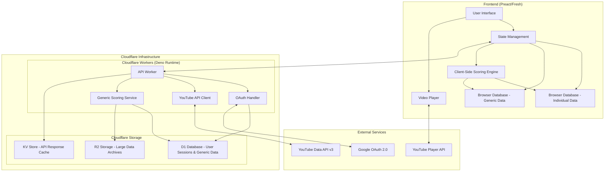

# Design Document

## Overview

The YouTube API Integration system implements a hybrid architecture combining a Deno backend service for YouTube API communication with a Preact/Fresh frontend that maintains local-first data storage principles. The system fetches user subscriptions, aggregates new content, applies algorithmic scoring, and provides video playback capabilities while storing all data locally in browser databases for offline access.

## Architecture

### High-Level Architecture



### Data Flow

1. **Authentication Flow**: User authenticates via OAuth 2.0 through Deno backend
2. **Subscription Sync**: Backend fetches subscriptions and forwards to frontend for local storage
3. **Content Aggregation**: Backend retrieves new videos from subscribed channels
4. **Generic Data Sync**: Backend optionally provides generic scoring data (aggregated trends, benchmarks)
5. **Client-Side Scoring**: Frontend calculates individualized scores using local algorithms + optional generic data
6. **Video Playback**: Direct integration with YouTube Player API from frontend
7. **Local Storage**: Individual data and generic data stored separately in browser databases

## Components and Interfaces

### Frontend Components

#### 1. Authentication Manager
```typescript
interface AuthManager {
  initiateLogin(): Promise<void>
  handleCallback(code: string): Promise<AuthToken>
  refreshToken(): Promise<AuthToken>
  logout(): void
  isAuthenticated(): boolean
}
```

#### 2. Subscription Manager
```typescript
interface SubscriptionManager {
  syncSubscriptions(): Promise<Subscription[]>
  getSubscriptions(): Promise<Subscription[]>
  getSubscriptionById(id: string): Promise<Subscription | null>
}

interface Subscription {
  id: string
  channelId: string
  title: string
  description: string
  thumbnail: string
  subscriberCount: number
  lastSyncDate: Date
}
```

#### 3. Content Manager
```typescript
interface ContentManager {
  syncNewContent(): Promise<Video[]>
  getVideos(filters?: VideoFilters): Promise<Video[]>
  markAsWatched(videoId: string): Promise<void>
  bookmarkVideo(videoId: string): Promise<void>
}

interface Video {
  id: string
  title: string
  description: string
  thumbnail: string
  channelId: string
  channelTitle: string
  publishedAt: Date
  duration: string
  viewCount: number
  likeCount: number
  commentCount?: number
  score?: number
  channelScore?: number // 1-80 component
  subscriptionScore?: number // 0-20 component
  lastScoreUpdate?: Date
  scoringStatus: ScoringStatus
  watched: boolean
  bookmarked: boolean
}

interface VideoFilters {
  channelId?: string
  watched?: boolean
  dateRange?: { start: Date; end: Date }
  scoreRange?: { min: number; max: number }
  includeAwaitingScoring?: boolean // Default: false
  scoringStatus?: ScoringStatus
}

enum ScoringStatus {
  AWAITING_SCORING = 'awaiting_scoring', // <24 hours old
  SCOREABLE = 'scoreable', // >1 hour, <24 hours old  
  SCORED = 'scored' // >24 hours old with calculated score
}
```

#### 4. Client-Side Scoring Engine
```typescript
interface ScoringEngine {
  calculateScore(video: Video, context: ScoringContext): Promise<number>
  updateScores(videos: Video[]): Promise<Video[]>
  canCalculateScore(video: Video): boolean // Must be >1 hour since publish
  getScoringStatus(video: Video): ScoringStatus
  filterByScoring(videos: Video[], includeAwaitingScoring: boolean): Video[]
  syncGenericData(): Promise<void> // Fetch latest generic scoring data
}

interface GenericDataManager {
  fetchChannelBenchmarks(channelIds: string[]): Promise<ChannelBenchmark[]>
  fetchTrendData(): Promise<TrendData[]>
  fetchCategoryAverages(): Promise<CategoryAverage[]>
  storeGenericData(data: GenericScoringData): Promise<void>
  getGenericData(): Promise<GenericScoringData | null>
}

interface GenericScoringData {
  channelBenchmarks: ChannelBenchmark[]
  trendData: TrendData[]
  categoryAverages: CategoryAverage[]
  lastSyncDate: Date
  dataSource: 'generic'
}

interface ScoringContext {
  individualData: {
    channelHistory: ChannelVideoHistory[]
    subscriptionVideos: Video[]
    userViewingHistory: ViewingHistory[]
  }
  genericData?: {
    channelBenchmarks: ChannelBenchmark[]
    globalTrends: TrendData[]
    categoryAverages: CategoryAverage[]
  }
  measurementPeriod: MeasurementPeriod
}

interface ChannelBenchmark {
  channelId: string
  averageViewsPerHour: number
  averageLikesPerHour: number
  videoCount: number
  dataSource: 'generic' // Always generic for benchmarks
  lastUpdated: Date
}

interface TrendData {
  category: string
  trendingTopics: string[]
  averageEngagement: number
  dataSource: 'generic'
  lastUpdated: Date
}

interface CategoryAverage {
  category: string
  averageScore: number
  videoCount: number
  dataSource: 'generic'
  lastUpdated: Date
}

interface ScoringConfig {
  measurementPeriod: MeasurementPeriod // 'week' | 'month' | 'year'
  minimumAgeHours: number // Default: 1 hour
  channelScoreRange: { min: number; max: number } // 1-80
  subscriptionScoreRange: { min: number; max: number } // 0-20
}

interface VelocityMetrics {
  viewsPerHour: number
  likesPerHour: number
  commentsPerHour: number
  hoursElapsed: number
}

interface ChannelVideoHistory {
  channelId: string
  videos: {
    id: string
    publishedAt: Date
    currentViews: number
    currentLikes: number
    velocityAtSameAge: VelocityMetrics
  }[]
}

type MeasurementPeriod = 'week' | 'month' | 'year'
```

#### 5. Video Player Component
```typescript
interface VideoPlayer {
  loadVideo(videoId: string): void
  play(): void
  pause(): void
  seekTo(seconds: number): void
  getCurrentTime(): number
  onStateChange(callback: (state: PlayerState) => void): void
}

enum PlayerState {
  UNSTARTED = -1,
  ENDED = 0,
  PLAYING = 1,
  PAUSED = 2,
  BUFFERING = 3,
  CUED = 5
}
```

### Backend Components (Cloudflare Workers)

#### 1. YouTube API Client
```typescript
interface YouTubeAPIClient {
  getSubscriptions(accessToken: string): Promise<SubscriptionResponse>
  getChannelVideos(channelId: string, maxResults: number): Promise<VideoResponse>
  getVideoDetails(videoIds: string[]): Promise<VideoDetailsResponse>
}
```

#### 2. OAuth Handler (using @deno/oauth)
```typescript
interface OAuthHandler {
  generateAuthUrl(): string
  exchangeCodeForTokens(code: string): Promise<TokenResponse>
  refreshAccessToken(refreshToken: string): Promise<TokenResponse>
  storeTokens(userId: string, tokens: TokenResponse): Promise<void>
  getStoredTokens(userId: string): Promise<TokenResponse | null>
}

// Implementation using Deno OAuth library
class CloudflareOAuthHandler implements OAuthHandler {
  constructor(
    private d1Database: D1Database,
    private clientId: string,
    private clientSecret: string
  ) {}
  
  generateAuthUrl(): string {
    // Using @deno/oauth or deno_oauth2
    return createGoogleOAuthUrl({
      clientId: this.clientId,
      redirectUri: 'https://your-worker.your-subdomain.workers.dev/auth/callback',
      scope: 'https://www.googleapis.com/auth/youtube.readonly'
    })
  }
}
```

#### 3. Cloudflare Storage Managers
```typescript
interface D1Manager {
  // User session and generic data storage
  storeUserSession(session: UserSession): Promise<void>
  getUserSession(sessionId: string): Promise<UserSession | null>
  storeGenericScoringData(data: GenericScoringData): Promise<void>
  getGenericScoringData(): Promise<GenericScoringData | null>
}

interface KVCacheManager {
  // Fast API response caching
  get<T>(key: string): Promise<T | null>
  set<T>(key: string, value: T, ttl?: number): Promise<void>
  delete(key: string): Promise<void>
}

interface R2StorageManager {
  // Large data archives (historical data, backups)
  storeArchive(key: string, data: ArrayBuffer): Promise<void>
  getArchive(key: string): Promise<ArrayBuffer | null>
  listArchives(prefix: string): Promise<string[]>
}
```

#### 4. Generic Scoring Data Service
```typescript
interface GenericScoringService {
  aggregateChannelBenchmarks(): Promise<ChannelBenchmark[]>
  calculateTrendData(): Promise<TrendData[]>
  computeCategoryAverages(): Promise<CategoryAverage[]>
  scheduleDataRefresh(): Promise<void>
}
```

## Data Models

### Browser Database Schema

#### Individual User Data (Primary Database)

#### Subscriptions Table
```sql
CREATE TABLE subscriptions (
  id TEXT PRIMARY KEY,
  channel_id TEXT UNIQUE NOT NULL,
  title TEXT NOT NULL,
  description TEXT,
  thumbnail TEXT,
  subscriber_count INTEGER,
  last_sync_date DATETIME,
  created_at DATETIME DEFAULT CURRENT_TIMESTAMP
);
```

#### Videos Table
```sql
CREATE TABLE videos (
  id TEXT PRIMARY KEY,
  title TEXT NOT NULL,
  description TEXT,
  thumbnail TEXT,
  channel_id TEXT NOT NULL,
  channel_title TEXT NOT NULL,
  published_at DATETIME NOT NULL,
  duration TEXT,
  view_count INTEGER,
  like_count INTEGER,
  comment_count INTEGER,
  score REAL,
  channel_score REAL, -- 1-80 component
  subscription_score REAL, -- 0-20 component
  scoring_status TEXT CHECK (scoring_status IN ('awaiting_scoring', 'scoreable', 'scored')) DEFAULT 'awaiting_scoring',
  last_score_update DATETIME,
  watched BOOLEAN DEFAULT FALSE,
  bookmarked BOOLEAN DEFAULT FALSE,
  watch_progress INTEGER DEFAULT 0,
  created_at DATETIME DEFAULT CURRENT_TIMESTAMP,
  FOREIGN KEY (channel_id) REFERENCES subscriptions(channel_id)
);

CREATE INDEX idx_videos_published_at ON videos(published_at);
CREATE INDEX idx_videos_channel_published ON videos(channel_id, published_at);
CREATE INDEX idx_videos_score ON videos(score DESC);
CREATE INDEX idx_videos_scoring_status ON videos(scoring_status, published_at);
```

#### Channel Velocity History Table
```sql
CREATE TABLE channel_velocity_history (
  id INTEGER PRIMARY KEY AUTOINCREMENT,
  channel_id TEXT NOT NULL,
  video_id TEXT NOT NULL,
  hours_elapsed INTEGER NOT NULL,
  views_per_hour REAL NOT NULL,
  likes_per_hour REAL NOT NULL,
  comments_per_hour REAL DEFAULT 0,
  recorded_at DATETIME DEFAULT CURRENT_TIMESTAMP,
  FOREIGN KEY (channel_id) REFERENCES subscriptions(channel_id),
  FOREIGN KEY (video_id) REFERENCES videos(id)
);

CREATE INDEX idx_velocity_channel_hours ON channel_velocity_history(channel_id, hours_elapsed);
```

#### Scoring Configuration Table
```sql
CREATE TABLE scoring_config (
  measurement_period TEXT PRIMARY KEY CHECK (measurement_period IN ('week', 'month', 'year')),
  is_active BOOLEAN DEFAULT FALSE,
  updated_at DATETIME DEFAULT CURRENT_TIMESTAMP
);

INSERT INTO scoring_config (measurement_period, is_active) VALUES ('month', TRUE);
```

#### Generic Scoring Data (Separate Database)

#### Channel Benchmarks Table
```sql
CREATE TABLE generic_channel_benchmarks (
  channel_id TEXT PRIMARY KEY,
  average_views_per_hour REAL NOT NULL,
  average_likes_per_hour REAL NOT NULL,
  video_count INTEGER NOT NULL,
  data_source TEXT DEFAULT 'generic' CHECK (data_source = 'generic'),
  last_updated DATETIME DEFAULT CURRENT_TIMESTAMP
);
```

#### Trend Data Table
```sql
CREATE TABLE generic_trend_data (
  id INTEGER PRIMARY KEY AUTOINCREMENT,
  category TEXT NOT NULL,
  trending_topics TEXT NOT NULL, -- JSON array
  average_engagement REAL NOT NULL,
  data_source TEXT DEFAULT 'generic' CHECK (data_source = 'generic'),
  last_updated DATETIME DEFAULT CURRENT_TIMESTAMP
);
```

#### Category Averages Table
```sql
CREATE TABLE generic_category_averages (
  category TEXT PRIMARY KEY,
  average_score REAL NOT NULL,
  video_count INTEGER NOT NULL,
  data_source TEXT DEFAULT 'generic' CHECK (data_source = 'generic'),
  last_updated DATETIME DEFAULT CURRENT_TIMESTAMP
);
```

#### Generic Data Sync Log
```sql
CREATE TABLE generic_data_sync_log (
  id INTEGER PRIMARY KEY AUTOINCREMENT,
  sync_type TEXT NOT NULL, -- 'benchmarks', 'trends', 'categories'
  records_updated INTEGER DEFAULT 0,
  sync_status TEXT CHECK (sync_status IN ('success', 'failed', 'partial')),
  error_message TEXT,
  synced_at DATETIME DEFAULT CURRENT_TIMESTAMP
);
```

### Backend Database Schema (Cloudflare D1)

#### User Sessions Table
```sql
CREATE TABLE user_sessions (
  id TEXT PRIMARY KEY,
  user_id TEXT NOT NULL,
  access_token TEXT NOT NULL,
  refresh_token TEXT NOT NULL,
  token_expires_at DATETIME NOT NULL,
  created_at DATETIME DEFAULT CURRENT_TIMESTAMP,
  last_accessed DATETIME DEFAULT CURRENT_TIMESTAMP
);

CREATE INDEX idx_user_sessions_user_id ON user_sessions(user_id);
CREATE INDEX idx_user_sessions_expires ON user_sessions(token_expires_at);
```

#### Generic Channel Benchmarks (Backend)
```sql
CREATE TABLE backend_channel_benchmarks (
  channel_id TEXT PRIMARY KEY,
  average_views_per_hour REAL NOT NULL,
  average_likes_per_hour REAL NOT NULL,
  video_count INTEGER NOT NULL,
  sample_size INTEGER NOT NULL,
  confidence_score REAL DEFAULT 0.5,
  last_calculated DATETIME DEFAULT CURRENT_TIMESTAMP
);
```

#### Generic Trend Analytics (Backend)
```sql
CREATE TABLE backend_trend_analytics (
  id INTEGER PRIMARY KEY AUTOINCREMENT,
  category TEXT NOT NULL,
  trending_keywords TEXT NOT NULL, -- JSON array
  average_engagement REAL NOT NULL,
  sample_size INTEGER NOT NULL,
  calculation_period TEXT NOT NULL, -- 'week', 'month', 'year'
  calculated_at DATETIME DEFAULT CURRENT_TIMESTAMP
);
```

#### API Usage Tracking
```sql
CREATE TABLE api_usage_log (
  id INTEGER PRIMARY KEY AUTOINCREMENT,
  user_id TEXT,
  endpoint TEXT NOT NULL,
  quota_used INTEGER DEFAULT 1,
  response_status INTEGER,
  response_time_ms INTEGER,
  requested_at DATETIME DEFAULT CURRENT_TIMESTAMP
);

CREATE INDEX idx_api_usage_user_date ON api_usage_log(user_id, requested_at);
```

#### User Preferences Table
```sql
CREATE TABLE user_preferences (
  key TEXT PRIMARY KEY,
  value TEXT NOT NULL,
  updated_at DATETIME DEFAULT CURRENT_TIMESTAMP
);
```

#### Viewing History Table
```sql
CREATE TABLE viewing_history (
  id INTEGER PRIMARY KEY AUTOINCREMENT,
  video_id TEXT NOT NULL,
  watched_at DATETIME DEFAULT CURRENT_TIMESTAMP,
  watch_duration INTEGER,
  completion_percentage REAL,
  FOREIGN KEY (video_id) REFERENCES videos(id)
);
```

### API Response Models

#### YouTube API Responses
```typescript
interface SubscriptionResponse {
  items: {
    id: string
    snippet: {
      channelId: string
      title: string
      description: string
      thumbnails: {
        default: { url: string }
        medium: { url: string }
        high: { url: string }
      }
    }
  }[]
  nextPageToken?: string
}

interface VideoResponse {
  items: {
    id: { videoId: string }
    snippet: {
      title: string
      description: string
      channelId: string
      channelTitle: string
      publishedAt: string
      thumbnails: {
        medium: { url: string }
        high: { url: string }
      }
    }
  }[]
}
```

## Error Handling

### Error Categories

1. **Authentication Errors**
   - Invalid or expired tokens
   - OAuth flow interruptions
   - Permission scope issues

2. **API Rate Limiting**
   - YouTube API quota exceeded
   - Request throttling
   - Temporary service unavailability

3. **Network Errors**
   - Connection timeouts
   - DNS resolution failures
   - CORS issues (backend only)

4. **Data Storage Errors**
   - Browser database quota exceeded
   - IndexedDB transaction failures
   - Data corruption or migration issues

### Error Handling Strategy

```typescript
interface ErrorHandler {
  handleAuthError(error: AuthError): Promise<void>
  handleAPIError(error: APIError): Promise<void>
  handleStorageError(error: StorageError): Promise<void>
  handleNetworkError(error: NetworkError): Promise<void>
}

class ErrorRecovery {
  // Exponential backoff for API calls
  async retryWithBackoff<T>(
    operation: () => Promise<T>,
    maxRetries: number = 3
  ): Promise<T>
  
  // Graceful degradation to cached data
  async fallbackToCachedData<T>(
    primarySource: () => Promise<T>,
    cacheSource: () => Promise<T>
  ): Promise<T>
}
```

## Testing Strategy

### Unit Testing
- **Frontend Components**: Test React components with @testing-library/preact
- **Business Logic**: Test scoring algorithms, data transformations, and state management
- **API Clients**: Mock YouTube API responses and test error scenarios
- **Database Operations**: Test CRUD operations with in-memory SQLite

### Integration Testing
- **API Integration**: Test complete OAuth flow and YouTube API communication
- **Database Integration**: Test data synchronization between backend and frontend
- **Player Integration**: Test YouTube Player API embedding and event handling

### End-to-End Testing
- **User Workflows**: Test complete user journeys from login to video playback
- **Offline Scenarios**: Test application behavior when backend is unavailable
- **Performance Testing**: Test with large subscription lists and video catalogs

### Testing Tools
- **Frontend**: Vitest, @testing-library/preact, MSW for API mocking
- **Backend**: Deno's built-in test runner, Supertest for HTTP testing
- **E2E**: Playwright for cross-browser testing
- **Database**: In-memory SQLite for isolated testing

## Technology Stack

### Frontend
- **Framework**: Preact + Fresh (Deno-based SSR)
- **Database**: IndexedDB (via Dexie.js or similar)
- **State Management**: Preact Signals or Zustand
- **Styling**: Tailwind CSS or Twind
- **Build Tool**: Fresh's built-in Deno tooling

### Backend (Cloudflare Workers)
- **Runtime**: Cloudflare Workers (V8 isolates, Deno-compatible)
- **OAuth Library**: `@deno/oauth` or `deno_oauth2`
- **Database**: Cloudflare D1 (SQLite-based)
- **Caching**: Cloudflare KV Store
- **Storage**: Cloudflare R2 (for archives)
- **Framework**: Hono.js (lightweight, fast)

### Deployment
- **Frontend**: Deno Deploy or Cloudflare Pages
- **Backend**: Cloudflare Workers
- **Database**: Cloudflare D1 (serverless SQLite)
- **CDN**: Cloudflare (automatic)
- **Domain**: Cloudflare DNS management

### Cost Optimization
- **Cloudflare Workers**: 100,000 requests/day free tier
- **D1 Database**: 5M reads, 100K writes/day free tier
- **KV Store**: 100K reads, 1K writes/day free tier
- **R2 Storage**: 10GB storage free tier
- **Total Cost**: Essentially free for moderate usage

## Performance Considerations

### Frontend Optimization
- **Virtual Scrolling**: Handle large video lists efficiently
- **Image Lazy Loading**: Load thumbnails on demand
- **Component Memoization**: Prevent unnecessary re-renders
- **Bundle Splitting**: Code splitting for faster initial load

### Backend Optimization (Cloudflare Workers)
- **Edge Computing**: Workers run at 300+ global locations for low latency
- **Request Batching**: Combine multiple YouTube API calls efficiently
- **KV Caching**: Cache subscription and video data with TTL in Cloudflare KV
- **D1 Connection Pooling**: Automatic connection management by Cloudflare
- **Rate Limit Management**: Implement intelligent request scheduling with KV-based counters
- **Cold Start Optimization**: V8 isolates start in <1ms (vs containers ~100ms)
- **Auto-scaling**: Automatic scaling based on demand

### Database Optimization
- **Indexing Strategy**: Index frequently queried columns (channel_id, published_at, score)
- **Data Pruning**: Implement retention policies for old video data
- **Batch Operations**: Use transactions for bulk data operations
- **Query Optimization**: Use efficient queries with proper WHERE clauses

### Velocity-Based Scoring Algorithm

#### Core Algorithm Design

The scoring system uses a two-component approach measuring video performance velocity:

**Component 1: Channel-Relative Score (1-80 points)**
1. **Velocity Calculation**: Measure views/hour and likes/hour since publication (minimum 1 hour elapsed)
2. **Historical Comparison**: Compare against same channel's previous videos at equivalent age
3. **Ranking Distribution**: Distribute 1-80 points based on performance ranking within channel
   - 80 points: Highest performing video in channel history
   - 1 point: Lowest performing video in channel history
   - Linear distribution between extremes

**Component 2: Subscription-Relative Score (0-20 points)**
1. **Cross-Channel Comparison**: Compare velocity against all subscription videos in measurement period
2. **Configurable Period**: Week/month/year comparison window
3. **Percentile Ranking**: 0-20 points based on percentile rank across all subscriptions

```typescript
class ClientSideVelocityScoring {
  constructor(
    private genericDataManager: GenericDataManager
  ) {}
  
  getScoringStatus(video: Video): ScoringStatus {
    const hoursElapsed = (Date.now() - video.publishedAt.getTime()) / (1000 * 60 * 60)
    
    if (hoursElapsed < 1) return ScoringStatus.AWAITING_SCORING
    if (hoursElapsed < 24) return ScoringStatus.SCOREABLE
    return ScoringStatus.SCORED
  }
  
  filterByScoring(videos: Video[], includeAwaitingScoring: boolean): Video[] {
    if (includeAwaitingScoring) {
      return videos // Show all videos
    }
    
    // Filter out videos <24 hours old by default
    return videos.filter(video => {
      const status = this.getScoringStatus(video)
      return status !== ScoringStatus.AWAITING_SCORING
    })
  }
  
  async calculateChannelScore(
    video: Video, 
    context: ScoringContext
  ): Promise<number> {
    // Only calculate for videos >1 hour old
    if (this.getScoringStatus(video) === ScoringStatus.AWAITING_SCORING) {
      throw new Error('Video too new for scoring')
    }
    
    // Calculate current velocity (views/hour, likes/hour)
    const currentVelocity = this.calculateVelocity(video)
    
    // Use individual channel history as primary data source
    const channelHistory = context.individualData.channelHistory
      .find(ch => ch.channelId === video.channelId)
    
    let historicalVelocities: VelocityMetrics[] = []
    
    if (channelHistory) {
      // Use individual historical data
      historicalVelocities = channelHistory.videos
        .map(v => v.velocityAtSameAge)
        .filter(v => v.hoursElapsed >= video.hoursElapsed - 1 && 
                     v.hoursElapsed <= video.hoursElapsed + 1)
    }
    
    // Fallback to generic benchmarks if insufficient individual data
    if (historicalVelocities.length < 3 && context.genericData) {
      const benchmark = context.genericData.channelBenchmarks
        .find(b => b.channelId === video.channelId)
      
      if (benchmark) {
        // Use generic benchmark as baseline
        historicalVelocities.push({
          viewsPerHour: benchmark.averageViewsPerHour,
          likesPerHour: benchmark.averageLikesPerHour,
          commentsPerHour: 0,
          hoursElapsed: video.hoursElapsed
        })
      }
    }
    
    // Rank current video against available data
    const rank = this.calculateRank(currentVelocity, historicalVelocities)
    
    // Convert rank to 1-80 scale
    return Math.max(1, Math.min(80, Math.round(rank * 79) + 1))
  }
  
  async calculateSubscriptionScore(
    video: Video,
    context: ScoringContext
  ): Promise<number> {
    // Use individual subscription data as primary source
    const periodVideos = this.filterByPeriod(
      context.individualData.subscriptionVideos, 
      context.measurementPeriod
    )
    const velocities = periodVideos.map(v => this.calculateVelocity(v))
    const currentVelocity = this.calculateVelocity(video)
    
    // Enhance with generic category data if available
    if (context.genericData && velocities.length < 10) {
      const categoryAverage = context.genericData.categoryAverages
        .find(ca => ca.category === this.getVideoCategory(video))
      
      if (categoryAverage) {
        // Add generic baseline to comparison set
        velocities.push({
          viewsPerHour: categoryAverage.averageScore * 100, // Approximate conversion
          likesPerHour: categoryAverage.averageScore * 5,
          commentsPerHour: 0,
          hoursElapsed: video.hoursElapsed
        })
      }
    }
    
    const percentile = this.calculatePercentile(currentVelocity, velocities)
    return Math.round(percentile * 20) // 0-20 points
  }
  
  private calculateVelocity(video: Video): VelocityMetrics {
    const hoursElapsed = Math.max(1, 
      (Date.now() - video.publishedAt.getTime()) / (1000 * 60 * 60)
    )
    
    return {
      viewsPerHour: video.viewCount / hoursElapsed,
      likesPerHour: video.likeCount / hoursElapsed,
      commentsPerHour: (video.commentCount || 0) / hoursElapsed,
      hoursElapsed
    }
  }
  
  private getVideoCategory(video: Video): string {
    // Simple category detection - could be enhanced
    return 'general' // Placeholder
  }
}
```

### Client-Side Scoring Algorithm Optimization
- **Minimum Age Requirement**: Only score videos >1 hour old
- **Dual Data Sources**: Individual data (primary) + generic data (fallback/enhancement)
- **Data Source Separation**: Clear distinction between individual and generic data in storage
- **Incremental Updates**: Recalculate scores as videos age and gain more data
- **Background Processing**: Calculate scores asynchronously using Web Workers to avoid UI blocking
- **Configurable Periods**: Support week/month/year comparison windows
- **Generic Data Sync**: Periodic background sync of generic scoring data from backend
- **Fallback Strategy**: Use generic benchmarks when insufficient individual data available
- **Privacy-First**: All individual scoring calculations remain client-side and local-only